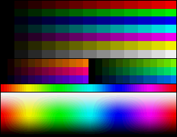
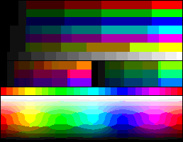

# Picture Painter

Draw images in Microsoft Paint.

## Requirements

### Python File

- Windows Operating System
- [Python 3.9](https://www.python.org/downloads/) or higher
- Packages listed in [`requirements.txt`](requirements.txt)

### Executable

Executable file with Python and all required packages included.

- Windows Operating System
- 12 MB of free space for the executable
- 14 MB of free space for temporary files

## Usage

Download the executable or source code from the [latest release](https://github.com/lemonyte/picture-painter/releases/latest).
Start the program and choose an image file using the "Browse" button. Supported file types are `.jpg`, `.jpeg`, `.jfif`, `.png`, and `.bmp`.

### IMPORTANT

This program will take full control of the mouse input. If something should go wrong, unintended consequences can happen if the program clicks outside the bounds of the Paint canvas. Use at your own risk. Before using, launch MS Paint and make it full screen. Then adjust the canvas size to fill most of the screen. This program has not been tested on high resolution displays above `1920x1080`. If you have multiple monitors, make sure Paint launches in your primary left-most display.

### Emergency Stops

The program has three kill switches built in.

- Press and hold the <kbd>ESC</kbd> key
- Press and hold the <kbd>Space</kbd> key
- Move the mouse pointer into the top left corner of the screen as fast as possible

Use these kill switches if you need to stop the program at any time while it is painting.

### Compression

The compression option specifies how much rounding to apply to the RGB values in the image. The lower the compression, the longer it will take to paint. Most of the time is spent switching between colors, which takes up a lot of time if there are a lot of individual pixels with unique colors. Medium is recommended because it provides a compromise between visual quality and time spent painting.

|Name|Description|Example|
|----|-----------|-------|
|None|No compression (16581375 colors)||
|Low|Rounded to the nearest even number (8290687 colors, 50%)||
|Medium|Rounded to the nearest 10 (17576 colors, 0.1%)||
|High|Rounded to the nearest 20 (3375 colors, 0.02%)||
|Extreme|Rounded to the nearest 50 (343 colors, 0.002%)||
|Retro 4|4-bit color palette (16 colors)||
|Retro 8|8-bit color palette (256 colors)||

### Brush Type

Brush type to use in MS Paint. This option does not affect painting duration, and makes virtually no visual difference to the final painting.

### Background Color

RGB color to fill the background with. RGB values must be separated by commas.

### Starting Position

Set the starting X and Y coordinates of the painting. Make sure the coordinates are in the top left corner of the MS Paint canvas.

### Pause

Sometimes MS Paint needs a delay to process all the new pixels that were painted. If you are getting broken paintings try turning this option on.

### Progress Update

Updating the progress bars every few pixels is another way of slowing down the painter. Decrease this value if you are getting broken paintings. Increasing it will make the painter faster.

After you are satisfied with the settings and have read the [IMPORTANT](#important) section, click "Draw" to start drawing.

## Disclaimer

I am not liable for any data loss, damage, or any other consequences resulting from use of this software. Use at your own risk.

## Credits

Original idea and code created by Reddit user [saulmessedupman](https://www.reddit.com/user/saulmessedupman/)  
[Reddit post](https://www.reddit.com/r/learnpython/comments/9weko5/what_useless_projects_are_you_working_on/)  
[Original code Pastebin](https://pastebin.com/zSrYLWtf)

## License

[MIT License](license.txt)
